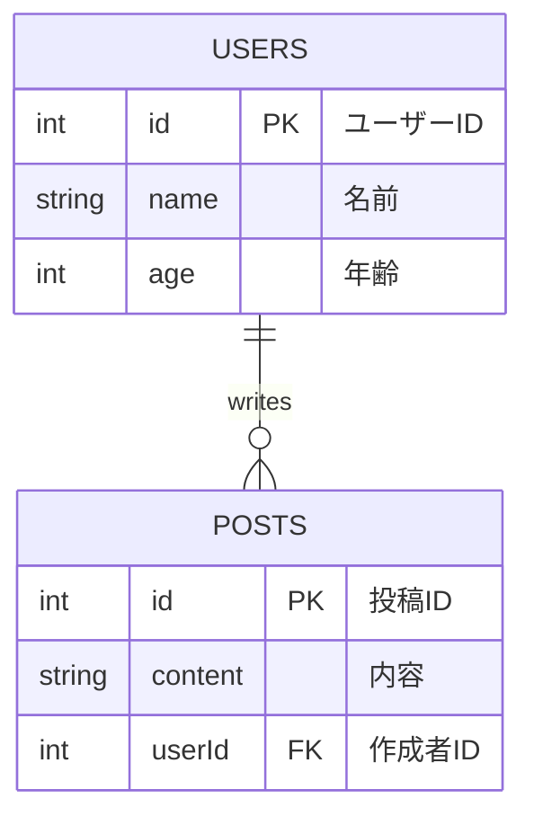

# graphql-example

## 概要

このプロジェクトは、GraphQLを用いたAPIの実装例です。
開発にはGraphQL-Yogaを利用しています。
DBクライアントにはdrizzleを採用しています。
簡便さのために、sqliteをデータベースとして使用しています。

### 技術スタック

| 名前               | バージョン       |
|---------------------|------------------|
| graphql            | ^16.8.1          |
| graphql-yoga        | ^5.3.1           |
| drizzle-orm        | ^0.30.10         |
| zod                | ^3.23.8          |
| better-sqlite3     | ^10.0.0          |
| dataloader         | ^2.2.2           |

### アプリ概要

#### データベース設計

このプロジェクトでは、`drizzle-orm`を使用してデータベースのスキーマを定義しています。主に二つのテーブル、`users`と`posts`があり、それぞれユーザー情報と投稿情報を格納しています。

##### usersテーブル

usersテーブルは、ユーザーに関する情報を格納しています。各ユーザーは一意のIDを持っており、名前と年齢を属性として持ちます。

##### postsテーブル

postsテーブルは、投稿に関する情報を格納しています。各投稿は一意のIDを持っており、内容と作成者のユーザーIDを属性として持ちます。作成者のユーザーIDはusersテーブルのIDと関連付けられており、投稿が属するユーザーを識別するために使用されます。

##### リレーション



#### 具体的なクエリ・ミューテーション
##### ユーザー関連
- `users`: 全てのユーザーを取得します。

##### 投稿関連
- `posts`: 全ての投稿を取得します。

##### ユーザー関連
- `createUser(data: CreateUserInput!)`: 新しいユーザーを作成します。
- `updateUser(id: ID!, data: UpdateUserInput!)`: 既存のユーザーを更新します。
- `deleteUser(id: ID!)`: 指定したIDのユーザーを削除します。

##### 投稿関連
- `createPost(data: CreatePostInput!)`: 新しい投稿を作成します。
- `updatePost(id: ID!, data: UpdatePostInput!)`: 既存の投稿を更新します。
- `deletePost(id: ID!)`: 指定したIDの投稿を削除します。

## 試すには

```sh
# v21への切り替え
nvm use
# pnpmの有効化
corepack enable pnpm
# 依存関係のインストール
pnpm i
# GraphQLスキーマ→TypeScript型定義生成(src/generated/配下に生成)
pnpm code:gen
# sqliteへのスキーマ反映
pnpm migrate
# 開発サーバ起動(http://localhost:4000/graphql)
pnpm dev
# DBをコンソール上で確認する場合(https://local.drizzle.studio)
pnpm studio
```
